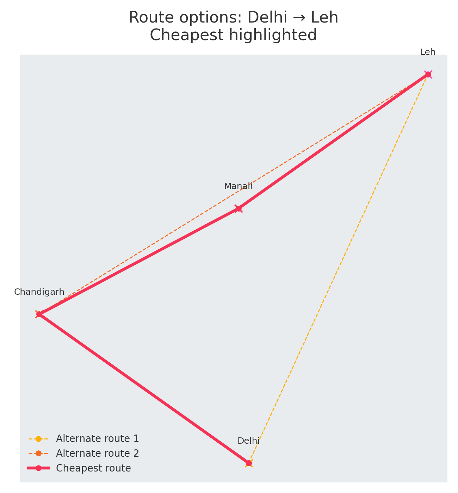

# Travel Planner – C++17 Route Engine 🚀

An **offline path‑finding engine** that parses real city/route data, builds a weighted graph, and outputs the **cheapest _or_ fastest** itinerary as an interactive Google‑Maps web page.

<p align="center">
  
</p>

---

## ✨ Features

| Category | What it does |
|----------|--------------|
| **Algorithmic Core** | Runs Dijkstra (⚡️ O((V + E) log V)) on a graph of locations & routes; easily extensible to A*. |
| **Configurable Metric** | Optimise by **`Metric::Cost`** *or* **`Metric::Time`** – no more magic booleans. |
| **Crash‑proof Parsing** | Hardened CSV loaders skip / log malformed rows instead of crashing. |
| **Google‑Maps Visualisation** | Generates a self‑contained HTML with markers, polylines & hop‑by‑hop tool‑tips. |
| **Modern C++ Build** | Warning‑free with `-Wall -Wextra`, AddressSanitizer clean, CMake one‑liner build. |

---

## 🔧 Quick Start

```bash
# clone
git clone https://github.com/<you>/travel-planner.git
cd travel-planner

# build (Release or Debug)
cmake -B build -DCMAKE_BUILD_TYPE=Release
cmake --build build

# run (Cheapest route Delhi ➜ Leh)
export MAPS_API_KEY=<your-google-maps-key>   # optional but recommended
./build/planner data/cities.csv data/routes.csv output.html Delhi Leh cost
open output.html        # or xdg-open on Linux
```

> **Tip:** The binary is AddressSanitizer‑clean – add `-DCMAKE_BUILD_TYPE=Debug` to verify.

---

## 🗂️ Code Layout

```
├── CMakeLists.txt          # 20‑line reproducible build
├── src/
│   ├── Main.cpp            # CLI wrapper
│   ├── GraphFunctions.h    # Dijkstra & helpers (Metric enum lives here)
│   ├── FileOperations.h    # CSV parsers + HTML generator
│   └── …                   # Data models (Location, Route)
└── data/
    ├── cities.csv
    └── routes.csv
```

---

## 🛣️ Internals – 3‑Step Flow

1. **Parse** → `locationParser()` & `routeParser()` load `cities.csv` + `routes.csv` into objects.  
2. **Search** → `Graph::Dijkstras(origin, Metric::Cost)` finds the optimal path, storing `lengthFromStart` & `parent` in each node.  
3. **Render** → `outputGenerator()` emits `output.html` with JS that plots the route on Google Maps.

---

## 🏗️ Extending the Project

* **A\*** with Haversine heuristic for faster long‑haul searches.  
* **REST wrapper** (FastAPI / Pistache) + Dockerfile to drop into a micro‑service.  
* **Unit tests** with GoogleTest (Dijkstra correctness, parser edge cases).  
* **Multi‑criterion scoring** (cost × time × carbon).

---

## 📜 License

MIT – do what you want, just give credit.  Pull requests welcome!

